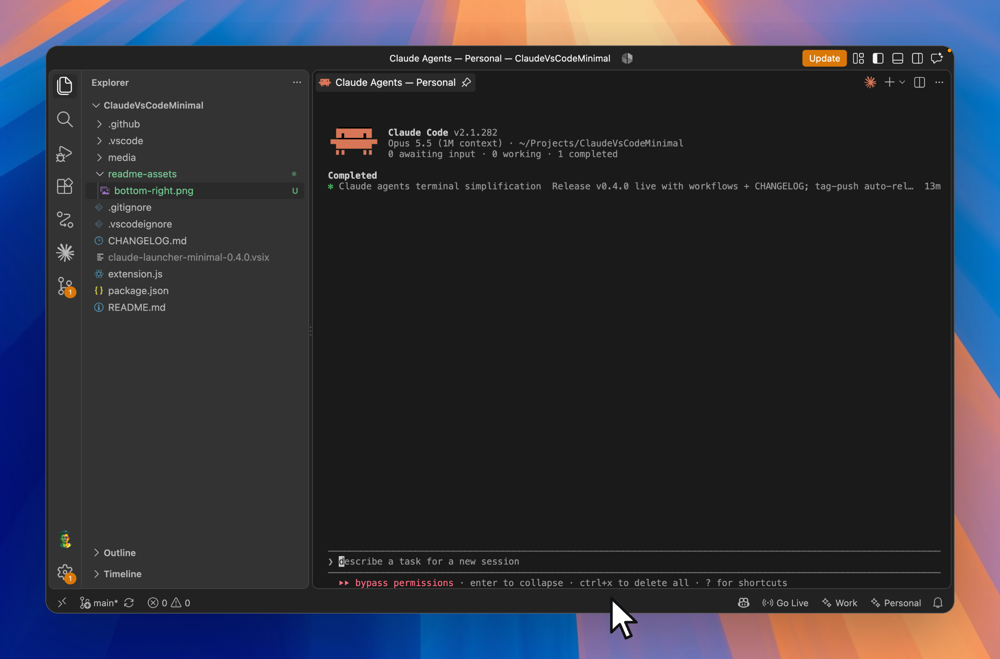
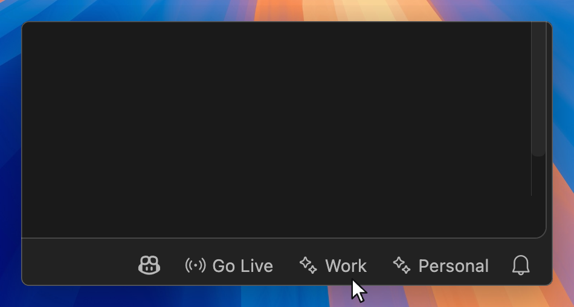
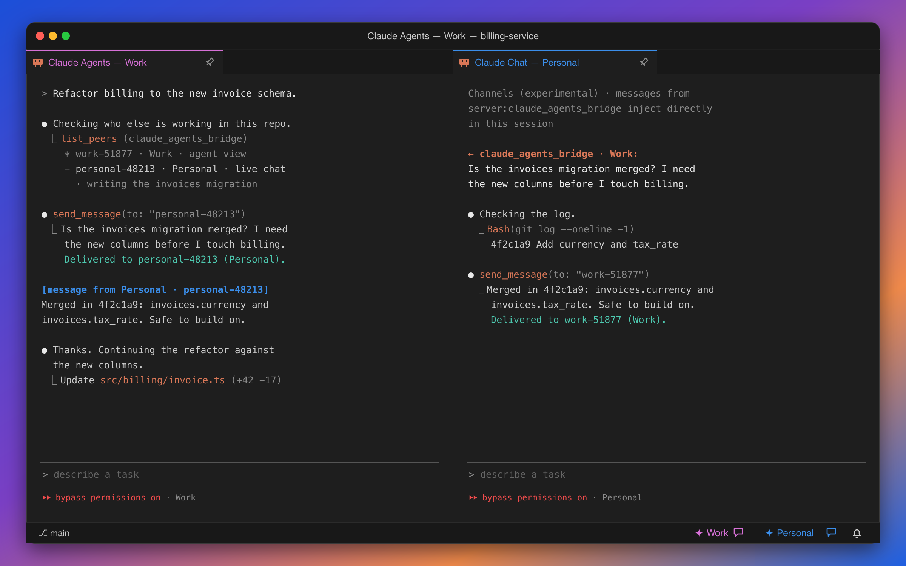
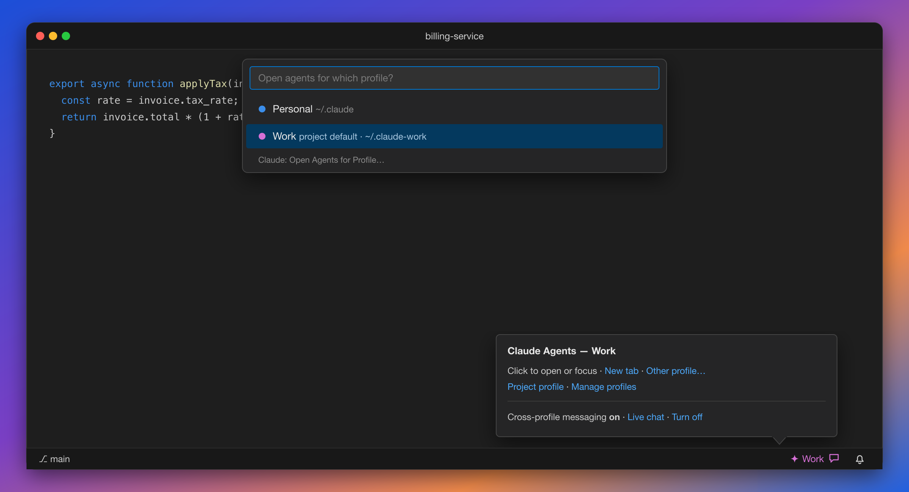

<div align="center">


# Claude Agents for VS Code

**Your Claude Code agents, one click away.**

A tiny button in your status bar opens Claude's agent view for the project you're in,
right inside your editor. No sidebar, no setup, no clutter.

[](https://marketplace.visualstudio.com/items?itemName=charanjit-singh.claude-launcher-minimal)
[](https://github.com/charanjit-singh/ClaudeVsCodeMinimal/releases/latest)

[**Install from the VS Code Marketplace →**](https://marketplace.visualstudio.com/items?itemName=charanjit-singh.claude-launcher-minimal)

</div>



---

## Why I built this

Moving from Cursor to Claude Code was a brain slap. In Cursor, chats lived right next to my code:
I opened one, did the work, came back to it later. With Claude Code, I was juggling terminals and
losing track of which session belonged to which project.

So I built the thing I was missing. Claude's agent view now sits one click away in every project.
**I treat each agent like a chat:** start one per task, come back to it later, and each project keeps
its own set. It feels like Cursor's chat panel, but it's running Claude Code.

---

## Why you'll like it

**⚡ One click, you're in.**
Click `✨ Claude` in the status bar, or press `⌘⌥A` (`Ctrl+Alt+A`), and `claude agents` opens for
your current project. Already open? The same click takes you back to it, even after a window reload,
so you don't end up with a pile of duplicate tabs.

**📌 It stays put.**
Agents open as a pinned editor tab next to your code, not squeezed into the bottom panel. Switch
files as much as you like and the tab stays where you left it.

**👥 Work and personal, side by side.**
Using more than one Claude account? Give each one its own button and its own color. Each profile
keeps its own config, its own login, and its own terminal, and you can add as many as you need.
Pin a project to one profile and only that button shows up there.



**💬 Agents that talk across accounts.**
A Work agent can ask a Personal one whether the migration is merged and get the answer back in the same
project. Turn on cross-profile messaging for a project, and every agent gets tools to find and message
the others. Open a live chat tab to receive messages the moment they're sent.
[See how it works →](docs/profile-communication.md)


<sub>Illustration</sub>

**🚀 Built for flow.**
Agents launch with full autonomy by default, so they don't stop to ask permission for every step.
Prefer to approve actions yourself? It's one setting to turn off.

**🪶 Nothing extra.**
No panels, no background indexing, no telemetry, no dependencies. It starts after VS Code finishes
loading and stays out of your way. Want your agents waiting for you when you open a project? Turn on one
setting.

---

## Get started in 30 seconds

1. **Install** from the [VS Code Marketplace](https://marketplace.visualstudio.com/items?itemName=charanjit-singh.claude-launcher-minimal),
   or search **"Claude Agents"** in the Extensions view, or run:
   ```bash
   code --install-extension charanjit-singh.claude-launcher-minimal
   ```
2. **Click** `✨ Claude` in the bottom-right corner of your status bar.

That's it. Prefer a manual install? Grab the `.vsix` from
[GitHub Releases](https://github.com/charanjit-singh/ClaudeVsCodeMinimal/releases/latest) and use
**Extensions** → `···` → **Install from VSIX…**

> **You'll need** the [Claude Code CLI](https://docs.claude.com/en/docs/claude-code) on your `PATH`
> and VS Code 1.93 or newer.

---

## Set up multiple accounts

Run **Claude: Manage Profiles** from the Command Palette, or hover any status bar button and click
**Manage profiles**. From there you can add a profile, pick its color, point it at its own config
folder, rename it, or delete it, all without touching JSON.

Prefer editing settings directly? Add this to your `settings.json`:

```jsonc
"claudeLauncher.profiles": [
  { "name": "Personal", "color": "blue" },
  { "name": "Work", "configDir": "~/.claude-work", "color": "magenta" }
]
```

Each profile gets its own status bar button. `configDir` points that profile at its own Claude
config folder (it's passed to Claude as `CLAUDE_CONFIG_DIR`), so your accounts, sessions, and
settings never mix. Leave `configDir` out to use the default `~/.claude`.

`color` tints the profile's button and its terminal tab so you always know which account you're
in. Pick from `black`, `red`, `green`, `yellow`, `blue`, `magenta`, `cyan`, or `white`; the exact
shade comes from your theme. A new color shows on the button right away. A tab that's already open
keeps its old color until you open a new one, because VS Code can't recolor an existing terminal.

The first time you launch a new profile, sign in once and you're done.

### Pin a project to one profile

Open the project, run **Claude: Set Project Profile** (or hover a button → **Project profile**), and
pick one. That window then shows only that profile's button, and the keyboard shortcut opens it
without asking. Pick **All profiles** to go back to showing every button.

Your choice is saved in the project's `.vscode/settings.json`, so it follows the repo. Commit that
file and anyone who shares your profile names gets the same setup.

Pinning sets the default. It doesn't lock you out. Your other profiles are one command away:
**Claude: Open Agents for Profile…**, **New Agents Tab for Profile…**, and **Open Live Chat for
Profile…** always let you pick, and the button's tooltip has an **Other profile…** link.


<sub>Illustration</sub>

---

## Let agents talk across profiles

Agents on different Claude accounts normally can't see each other. Turn on cross-profile messaging for a
project (**Claude: Toggle Cross-Profile Messaging**), and:

- every agent you start there gets `list_peers` and `send_message`, and receives messages between steps
- **Claude: Open Live Chat** opens a session that receives messages the moment they're sent, using
  [Claude Code channels](https://code.claude.com/docs/en/channels) (research preview)
- messages stay within the project, and never go into your repo or your Claude config

**[Read the full guide: Profile communication →](docs/profile-communication.md)**

---

## Per-project overrides in JSON

VS Code reads settings in two layers: your **User** settings apply everywhere, and **Workspace**
settings (`.vscode/settings.json` in the project) override them for that project. Every Claude
Agents setting works at both levels.

Put your accounts in **User** settings once (**Preferences: Open User Settings (JSON)**):

```jsonc
{
  "claudeLauncher.profiles": [
    { "name": "Personal", "color": "blue" },
    { "name": "Work", "configDir": "~/.claude-work", "color": "magenta" }
  ]
}
```

Then override per project in `.vscode/settings.json` (**Preferences: Open Workspace Settings (JSON)**):

```jsonc
{
  "claudeLauncher.defaultProfile": "Work",           // only the Work button, no questions
  "claudeLauncher.openOnStartup": true,              // agents open when this repo opens
  "claudeLauncher.dangerouslySkipPermissions": false // ask before acting, in this repo only
}
```

Worth knowing:

- **A workspace `profiles` list replaces yours; it doesn't merge.** If you set `claudeLauncher.profiles`
  in a project, that project sees only those profiles. Usually `defaultProfile` is all you need.
- **To show every button where your User settings pin one,** set `"claudeLauncher.defaultProfile": ""`
  in the project. **Set Project Profile → All profiles** does this for you.
- **In a multi-root workspace,** workspace settings live in the `.code-workspace` file instead.
- **Untrusted folders can't change the risky settings.** Until you trust a folder, its own settings
  can't change `profiles`, `dangerouslySkipPermissions`, `openOnStartup`, or `crossProfileMessaging`,
  and agents never open automatically there. A repo you just cloned can't make itself launch an agent or point Claude at
  its own config folder.

---

## Tips

| You want to… | Do this |
|---|---|
| Open or jump back to your agents | Click the profile's button, or press `⌘⌥A` / `Ctrl+Alt+A` |
| Open a second, separate agents tab | `⌘⌥⇧A` / `Ctrl+Alt+Shift+A`, or **Claude: New Agents Tab** |
| Give each account its own shortcut | Add a keybinding for `claudeLauncher.openAgents` with `"args": { "name": "Work" }` |
| Use one account in this project | **Claude: Set Project Profile**, or hover a button → **Project profile** |
| Open a different profile than the project's default | **Claude: Open Agents for Profile…**, or hover → **Other profile…** |
| Let agents on different accounts message each other | **Claude: Toggle Cross-Profile Messaging** ([guide](docs/profile-communication.md)) |
| Get messages the instant they're sent | **Claude: Open Live Chat** |
| Have agents open when you open a project | Turn on `claudeLauncher.openOnStartup` |
| Approve each action yourself | Set `claudeLauncher.dangerouslySkipPermissions` to `false` |
| Add an account, or change a color | **Claude: Manage Profiles**, or hover a button → **Manage profiles** |

Shortcut already taken? Rebind it in **Keyboard Shortcuts** (`⌘K ⌘S`) by searching "Claude Agents".

---

## Settings

| Setting | Default | What it does |
|---|---|---|
| `claudeLauncher.profiles` | `[{ "name": "Claude" }]` | One status bar button per entry. Optional `configDir` and `color` per profile. Easiest to edit with **Claude: Manage Profiles**. |
| `claudeLauncher.defaultProfile` | `""` | Set per workspace, easiest with **Claude: Set Project Profile**. Shows only this profile's button, and shortcuts use it without asking. |
| `claudeLauncher.crossProfileMessaging` | `false` | Set per project. Lets agents on different profiles message each other. See the [guide](docs/profile-communication.md). |
| `claudeLauncher.openOnStartup` | `false` | Opens the agents tab when a window opens. Works in single-folder workspaces when the profile is clear: your `defaultProfile`, or your only profile. |
| `claudeLauncher.dangerouslySkipPermissions` | `true` | Launches with `--dangerously-skip-permissions`. Turn it off if you want Claude to ask before acting. |

> ⚠️ With permissions skipped, agents can edit files and run commands without asking first.
> That's great for momentum, but only use it on projects where you're comfortable with that.

---

## Pairs well with: Sync Code Theme

Working on several projects at once? Install
[**sync-code-theme**](https://github.com/charanjit-singh/claude-plugins#sync-code-theme), a Claude Code
plugin that tints each VS Code window with its project's own brand colors. Combined with Claude Agents,
you can tell at a glance which window, and which agents, belong to which project.

---

## For contributors

```bash
git clone https://github.com/charanjit-singh/ClaudeVsCodeMinimal.git
cd ClaudeVsCodeMinimal
code .            # then press F5 to launch an Extension Development Host
```

Pushing a `vX.Y.Z` tag builds the `.vsix` and publishes a GitHub Release automatically, using that
version's notes from the [CHANGELOG](CHANGELOG.md).

---

<div align="center">
<sub>An independent community project. Not affiliated with or endorsed by Anthropic.</sub>
</div>
