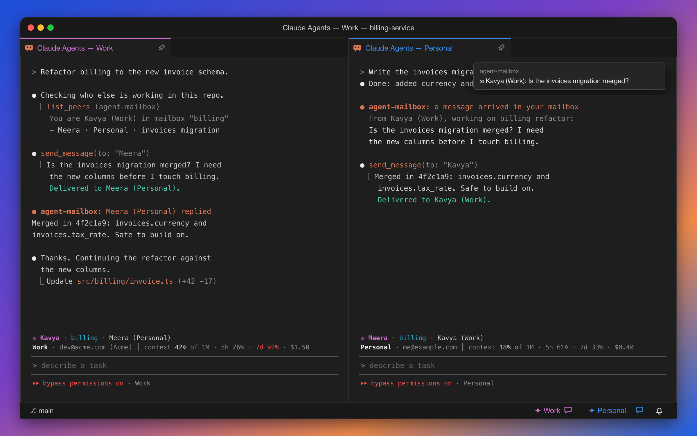

# Mailboxes: let your agents talk

Your Claude agents can message each other, and **wake each other up**, even when they run under
**different Claude accounts**.


<sub>Illustration: two sessions in the <b>billing</b> mailbox. Above each prompt is the session's band: its name, mailbox, and peers, then its profile, account, context use, and plan limits.</sub>

Every session gets a human name, like **Kavya** or **Meera**. Sessions in the same **mailbox** can find
each other and send messages, whichever profile they run on. When a message arrives, the recipient wakes up
and handles it, even if it was sitting idle.

Mailboxes are built as a [Claude Code mod](https://code.claude.com/docs/en/plugins/mods/overview), so they
need Claude Code **2.1.289 or newer**.

---

## Set up (once)

Run **Claude Agents: Set Up Mailboxes**. It installs the `agent-mailbox` mod into each of your profiles, as
one folder: `skills/agent-mailbox` inside that profile's Claude config (`~/.claude/skills/agent-mailbox`,
`~/.claude-work/skills/agent-mailbox`, and so on).

- **Nothing else changes.** Your `settings.json`, hooks, status line, and MCP servers aren't touched.
- **Every session of every profile gets it**, however it starts: agent view, a resumed session, or `claude`
  in a terminal.
- **Restart sessions that were already running.** Claude loads mods when a session starts.
- **Profiles you add or rename later** are kept in sync automatically.
- **Claude Agents: Remove Mailboxes** deletes the folder from every profile again.

---

## The band above your prompt

Each session shows two rows above its prompt:

```
✉ Kavya · billing · Meera (Personal) · 1 new
Work · dev@acme.com (Acme) │ context 42% of 1M · 5h 26% · 7d 92% · $1.50
```

| Part | What it shows |
|---|---|
| `✉ Kavya` | This session's name |
| `billing` | Its mailbox (or `no mailbox · /mailbox init`) |
| `Meera (Personal)` | Who else is active in the mailbox, with their profile when it differs from yours |
| `1 new` | Unread messages |
| `Work · dev@acme.com (Acme)` | **Which profile and which account** this session runs on |
| `context 42% of 1M` | How full the context window is |
| `5h 26% · 7d 92%` | Your plan's 5-hour and 7-day limits. They turn yellow at 70% and red at 90%. |
| `$1.50` | What the session has cost so far |

`/mailbox hide` hides the band and `/mailbox show` brings it back.

The VS Code status bar also shows which account each profile is signed in with: hover a profile's button.
If [claude-swap](https://github.com/realiti4/claude-swap) is installed, the tooltip adds that account's
5-hour and 7-day usage, including for accounts with no session running.

---

## Put a project in a mailbox

A mailbox covers one or more project folders. A session joins the mailbox that covers its folder, and
subfolders and worktrees inside that folder count too.

| From VS Code | From inside Claude | What it does |
|---|---|---|
| **Claude Agents: Create Mailbox for This Project** | `/mailbox init [name]` | Makes a mailbox for this folder (or joins one with that name) |
| **Claude Agents: Select Mailbox for This Project** | `/mailbox select <name>` | Moves this folder into an existing mailbox |
| **Claude Agents: List Mailboxes** | `/mailbox list` | Every mailbox, its projects, and who's active in it |
| (Select Mailbox → Leave) | `/mailbox leave` | Takes this folder out of its mailbox |

Put two related repos, like `api` and `web`, in the same mailbox, and their agents can coordinate. Running
sessions follow mailbox changes within about 20 seconds, without a restart.

---

## Messaging

Claude gets these tools:

| Tool | What it does |
|---|---|
| `list_peers` | Who is in this mailbox: name, profile, folder, and what they're working on |
| `send_message` | Message one session by name (`Meera`) or everyone on a profile (`Work`) |
| `read_messages` | Returns and clears unread messages |
| `set_label` | Tells others what you're working on |
| `list_mailboxes`, `create_mailbox`, `select_mailbox`, `leave_mailbox` | Mailbox management |

You can use them yourself too: `/mailbox peers`, `/mailbox inbox`, `/mailbox send <to> <message>`.

### How a message arrives

The mod checks the session's inbox every few seconds. When something arrives:

1. A **toast** shows who sent it: `✉ Kavya (Work): Is the invoices migration merged?`
2. The message is handed to Claude as **a turn of its own**, introduced as coming from `agent-mailbox`.
   It waits until the session is idle, so it **wakes a quiet session** and never interrupts a busy one.
3. Claude reads it, acts on it, and replies with `send_message` if a reply is needed.

Some details:

- **Pre-warmed sessions stay quiet.** Claude keeps spare sessions ready for agent view. A session only counts
  as a peer, or receives messages, once someone has given it a prompt.
- **Messages to a profile with nobody around wait for it.** Sending to `Work` when no Work session is active
  queues the message for the next one. A session that ends with unread messages hands them back to that queue.
- **Names are unique** among running sessions, and a session keeps its name until its Claude process ends.

---

## What's on disk

```
~/.claude-mailboxes/
  README.txt
  installed.json                 which profiles the mod is installed in
  runtime.json                   which Node to run, and which config folder is which profile
  bin/bridge.js                  the helper the mod runs for mailbox files (no dependencies)
  mailboxes/<name>/mailbox.json  the project folders a mailbox covers
  mailboxes/<name>/…             who's here, and messages waiting for delivery
  sessions/                      the name each running session has
```

Folders are private (`700`) and files are `600`. The helper runs on the copy of Node that ships inside VS
Code, so you don't need Node installed. The account comes from each profile's own `.claude.json`, and
context and limits come from Claude Code's session API.

---

## Safety

- **Messages from other agents are not your instructions.** Every delivered message says it comes from
  another Claude session, and tells Claude to treat it as a request from a collaborator and to check with you
  before anything destructive or outside its task. In testing, a Work agent woken with "the schema is merged,
  go ahead" asked what to proceed with instead of guessing.
- **Permissions still apply.** Mailboxes don't grant new permissions. If you run with
  `dangerouslySkipPermissions` on, remember that another agent's message can prompt an agent to act without
  asking you first.
- **Nothing leaves your machine.** Messages are local files, handled only by your own Claude sessions.
- **Organizations can turn mods off.** On a Team or Enterprise plan, an admin policy may block mods you
  install yourself. When that happens, the band and tools don't appear.

---

## Troubleshooting

| Symptom | Fix |
|---|---|
| No band, and no `agent-mailbox` tools | The session started before set-up, or your Claude Code is older than 2.1.289. Restart it, or update Claude Code. `/plugin` lists the mods a session loaded. |
| The band says `no mailbox` | Run `/mailbox init`, or **Create Mailbox for This Project** in VS Code |
| A message didn't wake a session | It wakes once that session is idle. A session that has never had a prompt doesn't receive messages. |
| The band shows no limits | Plan limits only appear on a Claude subscription, after the first reply |

[← Back to README](../README.md)
