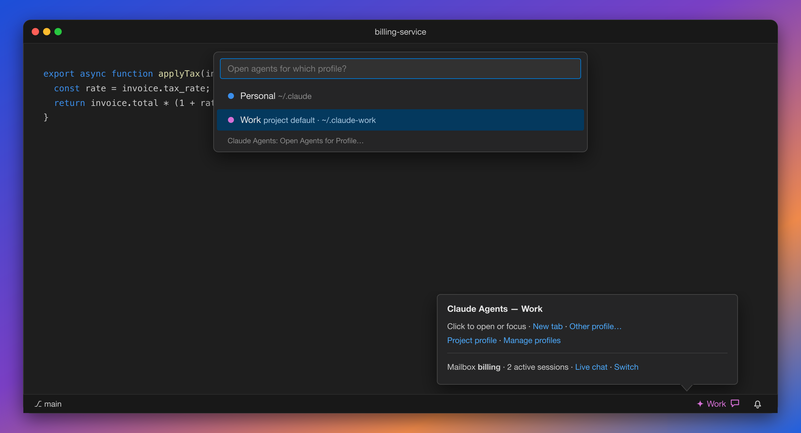

# Mailboxes: let your agents talk

Your Claude agents can message each other, even when they run under **different Claude accounts**.


<sub>Illustration: two sessions in the <b>billing</b> mailbox. Each one's name and mailbox show in its status line.</sub>

Every session gets a human name, like **Kavya** or **Meera**. Sessions in the same **mailbox** can find
each other and send messages, whichever profile they run on. Mailboxes live in one folder in your home
directory, so every profile, window, and terminal sees the same ones.

---

## Set up (once)

Run **Claude Agents: Set Up Mailboxes**. It shows exactly what it will add to each profile's Claude
config, and asks before changing anything:

| Added to each profile | Why |
|---|---|
| The `claude_mailbox` MCP server (user scope, added with `claude mcp add`) | Every session of that profile has the mailbox tools, however it was started: agent view, a resumed session, or `claude` in a terminal |
| Three hooks: after each tool call, on prompt, and before stopping | Hand new messages to a session between steps, without waiting for it to check |
| A status line segment | Shows the session's name, its mailbox, and who else is there |

- **Your status line is kept.** If a profile already has one, it still runs and shows first, and the
  mailbox segment appears after it.
- **Your other settings and hooks aren't touched.** The first time, a copy of each `settings.json` is saved
  next to it as `settings.json.before-claude-mailbox`.
- **Profiles you add or rename later** get set up automatically.
- **Restart sessions that were already running.** Claude loads MCP servers at startup, so sessions opened
  before set-up don't have the mailbox yet. (That's why older sessions said the MCP didn't exist.)
- **Claude Agents: Remove Mailboxes** undoes everything and restores your original status line.

---

## Put a project in a mailbox

A mailbox covers one or more project folders. A session joins the mailbox that covers its folder, and
subfolders and worktrees inside that folder count too.

| Command | What it does |
|---|---|
| **Claude Agents: Create Mailbox for This Project** | Makes a new mailbox (named after the folder, unless you choose another name) and puts this project in it |
| **Claude Agents: Select Mailbox for This Project** | Moves this project into an existing mailbox, or out of its current one |
| **Claude Agents: List Mailboxes** | Every mailbox, its projects, and who's active in it. From here you can use a mailbox for this project, reveal its folder, or delete it |

Put two related repos, like `api` and `web`, in the same mailbox, and their agents can coordinate.

Changes apply right away: running sessions move to the new mailbox within seconds, without a restart.

---

## Inside Claude

Every session has these tools:

| Tool | What it does |
|---|---|
| `list_peers` | Who is in this mailbox: name, profile, folder, and what they're working on |
| `send_message` | Message one session by name (`Meera`) or everyone on a profile (`Work`) |
| `read_messages` | Returns and clears unread messages |
| `set_label` | Tells others what you're working on |
| `list_mailboxes`, `create_mailbox`, `select_mailbox`, `leave_mailbox` | The same mailbox management as the VS Code commands |

There are slash commands too:

| Slash command | What it does |
|---|---|
| `/mcp__claude_mailbox__init [name]` | Joins or creates a mailbox for this project, then tells you who's there |
| `/mcp__claude_mailbox__peers` | Shows who's in this mailbox |
| `/mcp__claude_mailbox__inbox` | Summarizes your unread messages |
| `/mcp__claude_mailbox__send <to> <message>` | Sends a message |

### Names and the status line

Each session gets a name from a list of common Indian women's first names. It keeps that name for as long as
its Claude process runs, and no two live sessions share one. The status line shows it:

```
✉ Kavya · billing · Meera(Personal), Anika · 1 new
```

That line shows your name, then your mailbox, then who else is in it (with their profile when it differs
from yours), then any unread messages.

### When messages arrive

- **Agent view and regular sessions:** messages arrive after the next tool call, with your next prompt,
  or just before the session would stop, so it deals with them before going idle. A session that's already
  idle doesn't wake up by itself; it sees the message on its next turn.
- **Live chat:** run **Claude Agents: Open Live Chat** for a session that receives messages the instant
  they're sent, through [Claude Code channels](https://code.claude.com/docs/en/channels).
  - Channels are a research preview. Custom channels load only with `--dangerously-load-development-channels`,
    so you'll see a notice when the session starts, and your account or org has to have channels enabled.
  - If the startup notice warns that channels are unavailable, `read_messages` still returns everything sent
    live in the last hour, so nothing is lost.
- **Pre-warmed sessions don't count.** Claude keeps spare sessions ready for agent view. Those don't show up
  as peers or receive profile-wide messages until someone actually gives them a prompt.
- **Messages to a profile with nobody around wait.** Sending to `Work` when no Work session is active in the
  mailbox queues the message for the next one. A session that closes with unread messages hands them back to
  that queue.

---

## Using other profiles in a pinned project

A project pinned to one profile (**Claude Agents: Set Project Profile**) only shows that profile's button.
The others are still one command away:


<sub>Illustration: "Open Agents for Profile…" in a project pinned to Work.</sub>

| Command | What it does |
|---|---|
| **Claude Agents: Open Agents for Profile…** | Opens or focuses any profile's agents tab |
| **Claude Agents: New Agents Tab for Profile…** | Always opens a fresh agents tab |
| **Claude Agents: Open Live Chat for Profile…** | Opens or focuses any profile's live chat |

---

## What's on disk

```
~/.claude-mailboxes/
  README.txt
  installed.json                 which profiles it's set up in
  bin/bridge.js                  the MCP server, hook, and status line (one script, no dependencies)
  mailboxes/<name>/mailbox.json  the project folders this mailbox covers
  mailboxes/<name>/…             who's here, and messages waiting for delivery
  names/, sessions/              which name each running session has
  statusline/                    your original status lines, restored on removal
```

Folders are private (`700`) and files are `600`. The bridge runs on the copy of Node that ships inside
VS Code, so you don't need Node installed.

---

## Safety

- **Messages from other agents are not your instructions.** Every message reaches the agent with a note to
  treat it as a request from a collaborator, and to check with you before anything destructive or outside
  its task. In testing, an agent told "go ahead" by a peer reported the message and didn't act on it.
- **Permissions still apply.** Mailboxes don't grant new permissions. If you run with
  `dangerouslySkipPermissions` on, remember that another agent's message can prompt an agent to act without
  asking you first.
- **Nothing leaves your machine.** Messages are local files, handled only by your own Claude sessions.

---

## Troubleshooting

| Symptom | Fix |
|---|---|
| A session says the `claude_mailbox` MCP server doesn't exist | It started before set-up, or on a profile that isn't in your profiles list. Restart it. |
| `list_peers` says the project isn't in a mailbox | Run **Create Mailbox** or **Select Mailbox**, or `/mcp__claude_mailbox__init` in the session |
| A message never arrived | The recipient may be idle. It sees the message on its next turn, or it can call `read_messages`. |
| The status line has no ✉ segment | The session started before set-up. Restart it. |
| Live chat shows a channels warning | Channels aren't enabled for your account or org yet. Use `read_messages`, or message from a regular session. |

[← Back to README](../README.md)
